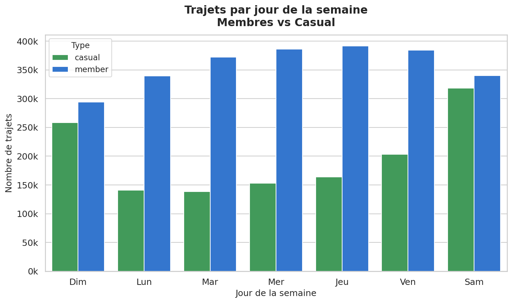
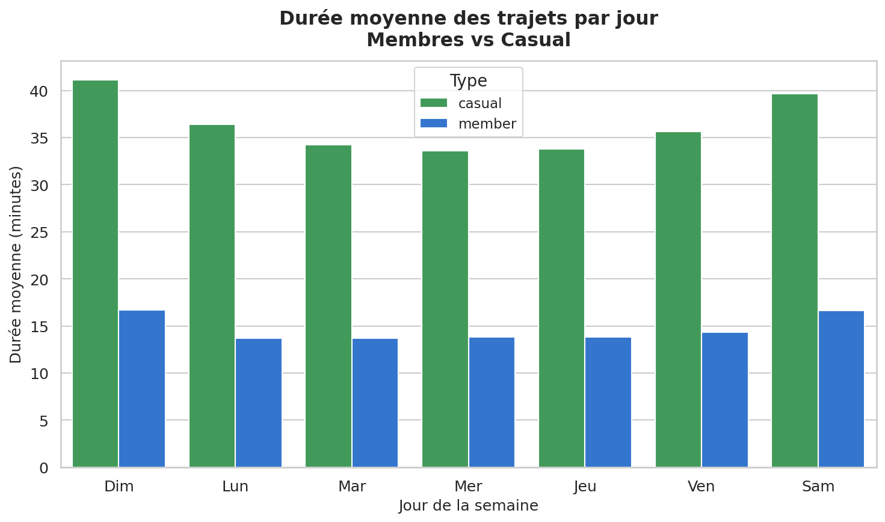
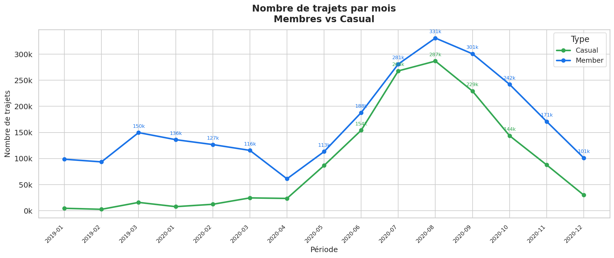
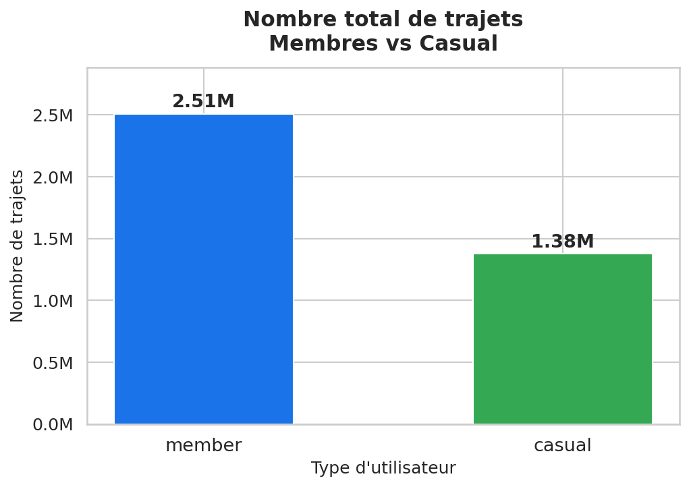
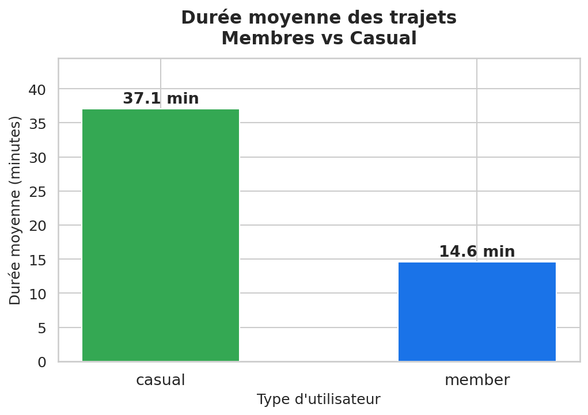
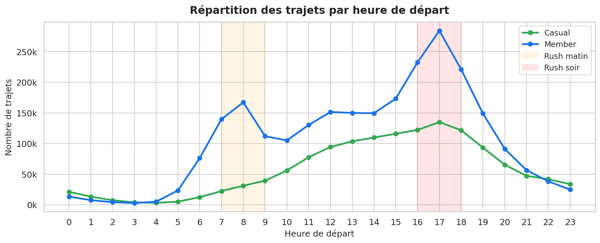
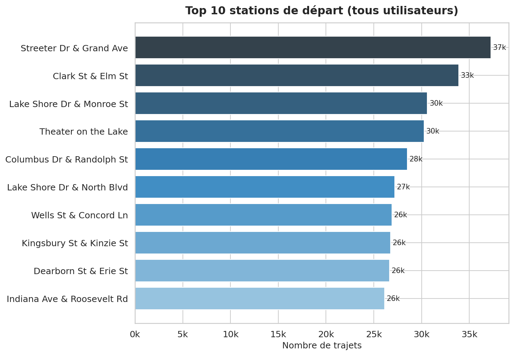

# 🚲 Cyclistic Bike-Share — Case Study

**Google Data Analytics Professional Certificate — Capstone Project**

> *Comment les membres annuels et les riders occasionnels utilisent-ils les vélos Cyclistic différemment ?*

---

## Contexte Business

**Cyclistic** est un programme de bike-share à Chicago comptant **5 800+ vélos** et **692 stations**. L'équipe marketing souhaite **convertir les riders occasionnels (casual) en membres annuels**, jugés plus rentables.

Ce case study analyse **3 885 439 trajets** sur la période **janvier 2019 – décembre 2020** pour identifier les différences comportementales entre les deux types d'utilisateurs et formuler des recommandations marketing actionnables.

---

## KPIs Clés

| Métrique | Members | Casual |
|---|---|---|
| Nombre de trajets | 2 508 757 (64,6%) | 1 376 682 (35,4%) |
| Durée moyenne | 14,6 min | 37,1 min |
| Durée médiane | 10,6 min | 21,7 min |
| Jour de pointe | Jeudi | Samedi |
| Usage principal | Domicile ↔ Travail | Loisirs / Tourisme |

---

## Méthodologie

```
Ask → Prepare → Process → Analyze → Share → Act
```

| Phase | Outil | Livrable |
|---|---|---|
| Prepare | — | `data/01_data_description.md` |
| Process | Python / pandas | `scripts/02_cleaning.py` → 3,885,439 trajets propres |
| Analyze | Python + SQL | `scripts/03_analysis.py` · `scripts/03_queries.sql` |
| Share (static) | Matplotlib / Seaborn | 8 graphiques PNG (`figures/`) |
| Share (interactif) | Plotly | `05_dashboard.html` |
| Share (Tableau) | Tableau Desktop | Dashboard 6 visualisations |
| Act | Rapport | `06_report.pdf` · `06_report.docx` |

---

## Insights Principaux

### 1. Usage Utilitaire vs Loisir

Les membres utilisent les vélos pour les **trajets domicile-travail** (doubles pics 8h et 17h en semaine).  
Les casual riders ont un usage **loisir/touristique** (montée progressive dès 10h, pic 15–17h, week-end).



---

### 2. Durée des trajets : 2,5× plus longue pour les casual

Les casual riders roulent **37 minutes en moyenne** contre **14,6 minutes** pour les membres.  
Même en semaine, les casual maintiennent des trajets longs → usage récréatif, pas fonctionnel.



---

### 3. Hyper-saisonnalité des casual riders

Les casual sont quasi-absents en hiver (57k trajets) et explosent en été (51,5% de leurs trajets annuels en juin–août).  
Les membres restent relativement actifs toute l'année (556k trajets en hiver).



---

### 4. Répartition globale




---

### 5. Comportement horaire



---

### 6. Top 10 Stations de départ

Les casual se concentrent sur les **stations touristiques** (Lakefront, Navy Pier, Millennium Park).  
Les membres utilisent les stations de **quartiers résidentiels et de bureaux**.



---

## Top 3 Recommandations Marketing

### Recommandation 1 — Campagne "Week-end → Abonnement" géolocalisée

**Insight :** casual riders actifs le week-end sur des stations touristiques.  
**Action :** Publicités géolocalisées (Instagram/TikTok) le vendredi soir et samedi matin dans un rayon de 500m autour des stations à forte fréquentation casual.  
**Message :** *"Tu roules déjà le week-end — économise avec l'abonnement annuel."*

---

### Recommandation 2 — Offre "Été → Membre" à tarif préférentiel

**Insight :** 51,5% des trajets casual se font en été → fenêtre de conversion optimale.  
**Action :** En mai–juin, proposer un abonnement annuel avec les 2 premiers mois offerts aux utilisateurs ayant effectué 3+ trajets en 30 jours. Email personnalisé avec calcul d'économies réalisées.

---

### Recommandation 3 — Calculateur d'économies "domicile-travail"

**Insight :** Les casual ignorent peut-être le potentiel utilitaire des vélos.  
**Action :** Intégrer dans l'app et le site un calculateur : *"Si tu fais X trajets/semaine, l'abonnement te coûte Y€/trajet vs Z€ en pass journée."* + contenu montrant des navetteurs membres.

---

## Structure du Projet

```
Cyclistic_Project/
├── data/
│   ├── raw/                    # 11 CSV Divvy (non versionnés — trop volumineux)
│   ├── processed/              # Données nettoyées (non versionnées)
│   ├── 01_data_description.md  # Documentation des sources
│   └── 02_cleaning_log.md      # Log du nettoyage
├── scripts/
│   ├── 02_cleaning.py          # Nettoyage + consolidation (pandas)
│   ├── 03_analysis.py          # Analyse descriptive
│   ├── 03_queries.sql          # 12 requêtes SQL (CTEs, window functions)
│   ├── 04_visualizations.py    # 8 graphiques matplotlib/seaborn
│   ├── 05_dashboard.py         # Dashboard interactif Plotly
│   ├── 06_tableau_export.py    # Export CSV pour Tableau
│   ├── export_pdf.py           # Génération PDF (reportlab)
│   └── export_docx.py          # Génération Word (python-docx)
├── figures/                    # 8 graphiques PNG
├── 05_dashboard.html           # Dashboard interactif (ouvrir dans un navigateur)
├── 06_report.pdf               # Rapport complet PDF
├── 06_report.docx              # Rapport complet Word
└── 07_tableau_guide.md         # Guide Tableau Desktop
```

---

## Technologies Utilisées


---

## Données

Source : [Divvy Trip Data](https://divvybikes.com/system-data) — Motivate International Inc.  
Licence : [Divvy Data License Agreement](https://divvybikes.com/data-license-agreement)  
Période couverte : Janvier 2019 – Décembre 2020  
Volume : 3 906 752 trajets bruts → **3 885 439 trajets après nettoyage**

---

## Auteur

**Junior Data Analyst** — Google Data Analytics Certificate  
Projet réalisé dans le cadre du Capstone Case Study 1 (Cyclistic)
